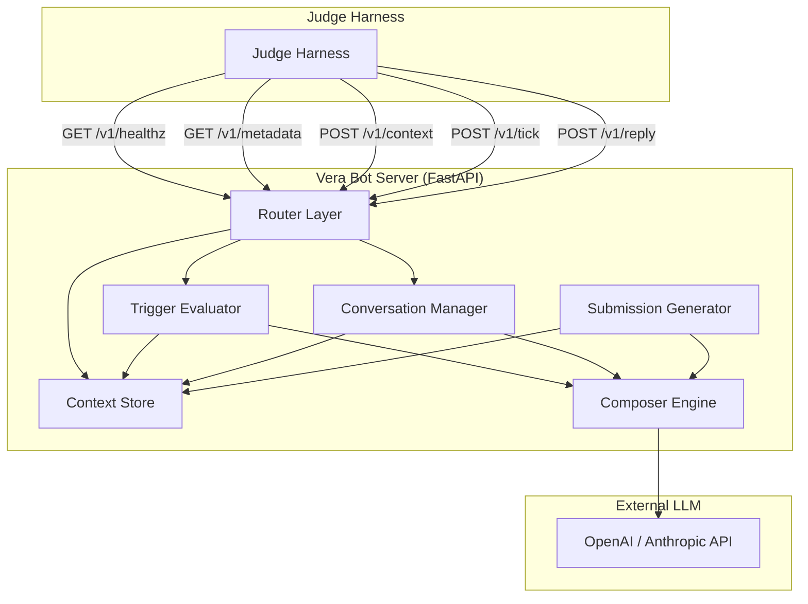
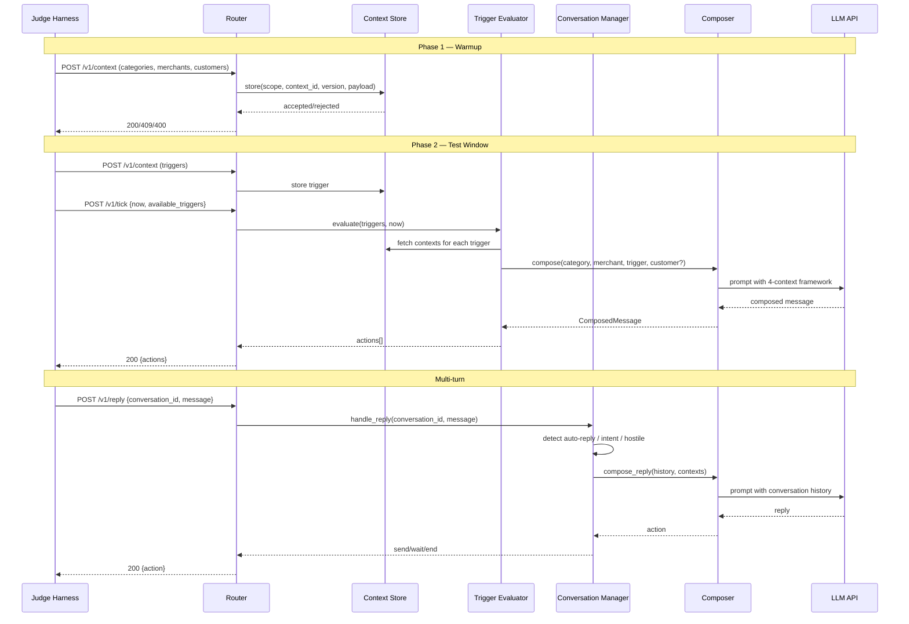

# Design Document — Vera Merchant Bot

## Overview

Vera Merchant Bot is a stateful HTTP bot server implementing the magicpin AI Challenge judge harness contract. It exposes 5 endpoints (`/v1/healthz`, `/v1/metadata`, `/v1/context`, `/v1/tick`, `/v1/reply`), persists pushed contexts in memory, composes high-quality WhatsApp messages using a 4-context LLM composition framework, handles multi-turn conversations with intent/auto-reply detection, and generates `submission.jsonl` for the 30 canonical test pairs.

The bot is built with Python/FastAPI and optimized for the 5-dimension scoring rubric: Specificity, Category Fit, Merchant Fit, Trigger Relevance, and Engagement Compulsion.

### Key Design Goals

1. **Score maximization** — Every architectural decision serves the 5-dimension rubric. The prompt engineering strategy is the core competitive differentiator.
2. **Operational reliability** — Meet all timeout budgets (2s healthz/metadata, 5s context, 10s tick/reply) with graceful degradation on LLM latency.
3. **Adaptive composition** — Incorporate mid-test context injections (new digest items, updated performance, new triggers) seamlessly.
4. **Conversation intelligence** — Detect auto-replies, intent transitions, hostile signals, and off-topic requests with high accuracy.
5. **Anti-pattern avoidance** — Structurally prevent known score-killers (generic offers, multiple CTAs, fabricated data, repetition, URLs in body).

---

## Architecture

### High-Level Architecture



### Request Flow



### Module Dependency Graph

```
bot.py (FastAPI app + router)
├── context_store.py      — In-memory versioned context persistence
├── trigger_evaluator.py  — Trigger ranking, suppression, expiry filtering
├── conversation_manager.py — Multi-turn state, auto-reply/intent/hostile detection
├── composer.py           — LLM composition engine with trigger-kind dispatch
│   ├── prompts/          — Trigger-kind-specific prompt templates
│   └── validators.py     — Post-composition anti-pattern checks
├── models.py             — Pydantic data models for all request/response shapes
├── submission.py         — submission.jsonl generator
└── config.py             — LLM provider config, timeouts, team metadata
```

---

## Components and Interfaces

### 1. Context Store (`context_store.py`)

The in-memory store that persists all pushed contexts with version tracking.

```python
class ContextStore:
    """Thread-safe in-memory context store with version tracking."""

    def __init__(self) -> None:
        self._store: dict[tuple[str, str], StoredContext] = {}
        self._lock: asyncio.Lock = asyncio.Lock()

    async def put(
        self, scope: str, context_id: str, version: int, payload: dict, delivered_at: str
    ) -> PutResult:
        """
        Atomically store a context if version is higher than current.
        Returns PutResult with accepted=True/False and reason.
        """

    def get(self, scope: str, context_id: str) -> StoredContext | None:
        """Retrieve the latest version of a context. Non-blocking read."""

    def get_all_by_scope(self, scope: str) -> list[StoredContext]:
        """Return all contexts for a given scope."""

    def count_by_scope(self) -> dict[str, int]:
        """Return {category: N, merchant: N, customer: N, trigger: N}."""

@dataclass
class StoredContext:
    scope: str
    context_id: str
    version: int
    payload: dict
    delivered_at: str
    stored_at: str

@dataclass
class PutResult:
    accepted: bool
    reason: str | None = None       # "stale_version" | "invalid_scope" | None
    current_version: int | None = None
    ack_id: str | None = None
    stored_at: str | None = None
```

**Design decisions:**
- `asyncio.Lock` for write atomicity — reads are lock-free since Python dict operations are atomic for single-key reads.
- Version comparison is strict greater-than (not >=), matching the spec: equal version is rejected as stale.
- Valid scopes are `{"category", "merchant", "customer", "trigger"}` — anything else returns 400.

### 2. Trigger Evaluator (`trigger_evaluator.py`)

Decides which triggers to act on during a tick, applying suppression and expiry rules.

```python
class TriggerEvaluator:
    """Evaluates available triggers, applies suppression/expiry, ranks by urgency."""

    def __init__(self, context_store: ContextStore) -> None:
        self._store = context_store
        self._fired_suppression_keys: set[str] = set()
        self._suppressed_conversations: set[str] = set()

    async def evaluate(
        self, available_trigger_ids: list[str], now: str, composer: Composer
    ) -> list[TickAction]:
        """
        For each trigger:
        1. Skip if suppression_key already fired
        2. Skip if expires_at < now
        3. Retrieve associated merchant, category, and optionally customer contexts
        4. Rank by urgency (descending)
        5. Compose message via Composer
        6. Record suppression_key as fired
        7. Cap at 20 actions
        """

    def record_suppression(self, key: str) -> None:
        """Mark a suppression key as fired."""

    def is_suppressed(self, key: str) -> bool:
        """Check if a suppression key has been fired."""

    def suppress_conversation(self, conversation_id: str) -> None:
        """Prevent future messages on this conversation_id."""
```

**Design decisions:**
- Triggers are sorted by `urgency` descending before composition — highest urgency triggers get composed first within the timeout budget.
- Suppression keys persist for the entire test run (in-memory set).
- The 20-action cap is enforced after composition, not before — we compose up to 20 and stop.

### 3. Conversation Manager (`conversation_manager.py`)

Tracks multi-turn conversation state and classifies incoming messages.

```python
class ConversationManager:
    """Manages multi-turn conversation state and message classification."""

    def __init__(self, context_store: ContextStore) -> None:
        self._store = context_store
        self._conversations: dict[str, ConversationState] = {}

    async def handle_reply(
        self, conversation_id: str, merchant_id: str, customer_id: str | None,
        from_role: str, message: str, received_at: str, turn_number: int,
        composer: Composer
    ) -> ReplyAction:
        """
        1. Append message to conversation history
        2. Classify message (auto_reply, intent_committed, hostile, off_topic, normal)
        3. Route to appropriate handler
        4. Return send/wait/end action
        """

    def classify_message(self, message: str, conversation: ConversationState) -> MessageClassification:
        """
        Classify incoming message using pattern matching + heuristics.
        Returns one of: auto_reply, intent_committed, hostile_optout, off_topic, normal
        """

    def get_history(self, conversation_id: str) -> list[Turn]:
        """Return full conversation history for a conversation_id."""

@dataclass
class ConversationState:
    conversation_id: str
    merchant_id: str
    customer_id: str | None
    trigger_id: str | None
    phase: str  # "initiating" | "qualifying" | "action_committed" | "waiting" | "ended"
    turns: list[Turn]
    auto_reply_streak: int
    sent_bodies: set[str]  # for anti-repetition

@dataclass
class Turn:
    role: str       # "bot" | "merchant" | "customer"
    message: str
    timestamp: str
    turn_number: int

class MessageClassification(str, Enum):
    AUTO_REPLY = "auto_reply"
    INTENT_COMMITTED = "intent_committed"
    HOSTILE_OPTOUT = "hostile_optout"
    OFF_TOPIC = "off_topic"
    NORMAL = "normal"
```

**Auto-reply detection heuristics:**
- Pattern matching against common WhatsApp Business auto-reply phrases:
  - "Thank you for contacting"
  - "Our team will respond shortly"
  - "We have received your message"
  - "automated assistant"
  - "will get back to you"
- Exact-match detection: if the same message text appears 2+ times consecutively from the merchant.
- Escalation: 1st auto-reply → send acknowledgment, 2nd consecutive → wait 4+ hours, 3rd+ → end.

**Intent transition detection:**
- Commitment phrases: "let's do it", "yes go ahead", "ok what's next", "sounds good let's proceed", "yes please", "go ahead", "I'm in", "let's start"
- When detected, set phase to `action_committed` and instruct the Composer to produce action-mode output.

**Hostile/opt-out detection:**
- Opt-out phrases: "stop messaging", "not interested", "unsubscribe", "leave me alone", "stop", "don't message"
- Hostile indicators: profanity, "useless", "spam", "bothering me"
- When detected, respond with `action: "end"` (optionally with brief apology) and suppress the conversation.

### 4. Composer Engine (`composer.py`)

The LLM-powered composition module — the core competitive differentiator.

```python
class Composer:
    """LLM-powered 4-context message composer with trigger-kind dispatch."""

    def __init__(self, llm_client: LLMClient, context_store: ContextStore) -> None:
        self._llm = llm_client
        self._store = context_store
        self._prompt_registry: dict[str, PromptTemplate] = self._load_prompts()

    async def compose(
        self,
        category: dict,
        merchant: dict,
        trigger: dict,
        customer: dict | None = None,
        conversation_history: list[Turn] | None = None,
        sent_bodies: set[str] | None = None,
    ) -> ComposedMessage:
        """
        1. Select prompt variant by trigger.kind
        2. Build structured prompt with all 4 contexts
        3. Call LLM
        4. Parse and validate response
        5. Run anti-pattern checks
        6. Return ComposedMessage
        """

    async def compose_reply(
        self,
        category: dict,
        merchant: dict,
        trigger: dict | None,
        customer: dict | None,
        conversation_history: list[Turn],
        classification: MessageClassification,
        sent_bodies: set[str],
    ) -> ReplyAction:
        """
        Compose a reply in the context of an ongoing conversation.
        Uses conversation history + classification to determine response shape.
        """

    def _select_prompt(self, trigger_kind: str) -> PromptTemplate:
        """Dispatch to trigger-kind-specific prompt variant."""

    def _build_context_block(
        self, category: dict, merchant: dict, trigger: dict, customer: dict | None
    ) -> str:
        """Serialize contexts into a structured prompt section."""

    async def _validate_and_fix(self, message: ComposedMessage, contexts: dict) -> ComposedMessage:
        """
        Post-composition validation:
        - Check for taboo vocabulary
        - Ensure single CTA at end
        - Check for URLs in body
        - Verify no fabricated data
        - Check against sent_bodies for repetition
        """

@dataclass
class ComposedMessage:
    body: str
    cta: str
    send_as: str            # "vera" | "merchant_on_behalf"
    suppression_key: str
    rationale: str
    template_name: str
    template_params: list[str]
```

**Prompt dispatch strategy by trigger kind:**

| Trigger Kind | Prompt Variant | Key Composition Elements |
|---|---|---|
| `research_digest` | `prompt_research.py` | Source citation, trial size, patient segment relevance, peer-tone |
| `recall_due` | `prompt_recall.py` | Specific slots, service price from catalog, customer recall window, language pref |
| `perf_dip` / `seasonal_perf_dip` | `prompt_perf.py` | Metric delta, contextualize (expected vs concerning), concrete next step |
| `active_planning_intent` | `prompt_planning.py` | Complete drafted artifact (pricing tiers, program structure), no qualifying questions |
| `supply_alert` | `prompt_alert.py` | Batch numbers, manufacturer, affected customer count |
| `renewal_due` | `prompt_renewal.py` | Days remaining, plan value, performance context |
| `competitor_opened` | `prompt_competitor.py` | Competitor details, differentiation strategy |
| `review_theme_emerged` | `prompt_review.py` | Theme, occurrence count, common quote, action plan |
| `milestone_reached` | `prompt_milestone.py` | Metric, current value, milestone value, celebration + next goal |
| `ipl_match_today` | `prompt_event.py` | Match details, data-informed recommendation |
| `customer_lapsed_*` | `prompt_winback.py` | Days since last visit, previous focus, no-shame framing |
| `chronic_refill_due` | `prompt_refill.py` | Molecule list, stock-out date, delivery option, senior-friendly |
| `trial_followup` | `prompt_trial.py` | Trial date, next session options |
| `festival_upcoming` | `prompt_festival.py` | Festival name, days until, category-specific relevance |
| `dormant_with_vera` | `prompt_reengagement.py` | Days since last message, last topic, fresh hook |
| Default | `prompt_generic.py` | General 4-context composition |

**Prompt engineering strategy for score maximization:**

Each prompt template follows a consistent structure optimized for the 5-dimension rubric:

```
SYSTEM PROMPT:
You are Vera, a merchant AI assistant for magicpin. You compose WhatsApp messages
for Indian merchants and their customers.

VOICE RULES (from CategoryContext):
- Tone: {category.voice.tone}
- Allowed vocabulary: {category.voice.vocab_allowed}
- FORBIDDEN vocabulary (never use): {category.voice.vocab_taboo}
- Salutation: {category.voice.salutation_examples}

COMPOSITION RULES (enforced structurally):
1. Use service-at-price format ("Dental Cleaning @ ₹299") not generic discounts
2. ONE primary CTA only, positioned as the FINAL sentence
3. NO URLs in the message body
4. NO preambles ("I hope you're doing well")
5. NO re-introductions after the first message in a conversation
6. Reference ONLY facts present in the provided contexts — do NOT fabricate
7. Include at least one compulsion lever: specificity, loss aversion, social proof,
   effort externalization, curiosity, reciprocity, asking-the-merchant, or single binary commitment
8. Honor language preferences: {merchant.identity.languages} / {customer.identity.language_pref}
9. Keep messages concise — WhatsApp readability

CONTEXT BLOCK:
[Structured serialization of category, merchant, trigger, customer]

TRIGGER-SPECIFIC INSTRUCTIONS:
[Varies by trigger kind — see dispatch table above]

OUTPUT FORMAT (JSON):
{
  "body": "the WhatsApp message",
  "cta": "open_ended | binary_yes_no | binary_confirm_cancel | multi_choice_slot | none",
  "send_as": "vera | merchant_on_behalf",
  "suppression_key": "from trigger",
  "rationale": "1-2 sentences explaining why this message, what compulsion lever, what it should achieve",
  "template_name": "template identifier",
  "template_params": ["param1", "param2", ...]
}
```

**Compulsion lever injection strategy:**

The prompt explicitly instructs the LLM to use specific levers based on trigger kind:

| Trigger Kind | Primary Lever | Secondary Lever |
|---|---|---|
| `research_digest` | Curiosity + Reciprocity | Specificity (source citation) |
| `recall_due` | Loss aversion (overdue window) | Effort externalization (slots ready) |
| `perf_dip` | Loss aversion (metric drop) | Social proof (peer comparison) |
| `active_planning_intent` | Effort externalization (drafted artifact) | Specificity (pricing/structure) |
| `supply_alert` | Urgency + Specificity | Reciprocity (customer list ready) |
| `competitor_opened` | Curiosity + Loss aversion | Social proof (peer positioning) |
| `milestone_reached` | Social proof (achievement) | Curiosity (next milestone) |
| `ipl_match_today` | Specificity (match data) | Contrarian insight |
| `customer_lapsed_*` | No-shame + Effort externalization | Specificity (new offering) |

### 5. LLM Client (`llm_client.py`)

Abstraction over LLM providers with timeout management.

```python
class LLMClient:
    """Async LLM client with timeout management and fallback."""

    def __init__(self, provider: str, api_key: str, model: str, timeout: float = 8.0) -> None:
        self._provider = provider
        self._api_key = api_key
        self._model = model
        self._timeout = timeout

    async def complete(self, system_prompt: str, user_prompt: str) -> str:
        """
        Call the LLM with timeout. If timeout is exceeded, raise TimeoutError.
        Supports: openai, anthropic, deepseek, groq, openrouter.
        """

    async def complete_with_fallback(
        self, system_prompt: str, user_prompt: str, fallback_response: str
    ) -> str:
        """
        Try LLM completion; on timeout or error, return fallback_response.
        Used for tick/reply endpoints to meet timeout budgets.
        """
```

**Timeout budget allocation:**
- `/v1/tick` has 10s budget → allocate 8s per LLM call, 2s for context retrieval + response building. Process triggers sequentially; stop composing when remaining budget < 2s.
- `/v1/reply` has 10s budget → allocate 8s for LLM call, 2s for classification + response building.
- If LLM times out, return `{"actions": []}` for tick or `{"action": "wait", "wait_seconds": 60}` for reply.

### 6. Anti-Pattern Validator (`validators.py`)

Post-composition checks that structurally prevent score-killing patterns.

```python
class AntiPatternValidator:
    """Validates composed messages against known anti-patterns."""

    def validate(self, message: ComposedMessage, category: dict, sent_bodies: set[str]) -> list[str]:
        """
        Returns list of violations found. Empty list = valid.
        Checks:
        1. Taboo vocabulary from category.voice.vocab_taboo
        2. Multiple CTAs detected in body
        3. CTA not at end of message
        4. URLs in body (http://, https://, www.)
        5. Long preambles ("I hope you're doing well", "Good morning")
        6. Body matches a previously sent body in sent_bodies
        7. Generic discount format when service-at-price is available
        """

    def fix(self, message: ComposedMessage, violations: list[str]) -> ComposedMessage:
        """
        Attempt to fix minor violations (remove URLs, trim preambles).
        Major violations (fabrication, wrong voice) trigger a re-composition.
        """
```

### 7. Submission Generator (`submission.py`)

Generates `submission.jsonl` for the 30 canonical test pairs.

```python
class SubmissionGenerator:
    """Generates submission.jsonl from expanded dataset test pairs."""

    def __init__(self, context_store: ContextStore, composer: Composer) -> None:
        self._store = context_store
        self._composer = composer

    async def generate(self, test_pairs_path: str, output_path: str = "submission.jsonl") -> None:
        """
        1. Load test_pairs.json
        2. For each pair, retrieve contexts from store
        3. Compose message via Composer
        4. Write JSON line to output
        5. Complete within 15 minutes
        """
```

---

## Data Models

### Request Models (Pydantic)

```python
class ContextPushRequest(BaseModel):
    scope: str
    context_id: str
    version: int
    payload: dict[str, Any]
    delivered_at: str

class TickRequest(BaseModel):
    now: str
    available_triggers: list[str] = []

class ReplyRequest(BaseModel):
    conversation_id: str
    merchant_id: str | None = None
    customer_id: str | None = None
    from_role: str
    message: str
    received_at: str
    turn_number: int
```

### Response Models

```python
class HealthResponse(BaseModel):
    status: str = "ok"
    uptime_seconds: int
    contexts_loaded: dict[str, int]

class MetadataResponse(BaseModel):
    team_name: str
    team_members: list[str]
    model: str
    approach: str
    contact_email: str
    version: str
    submitted_at: str

class ContextAcceptedResponse(BaseModel):
    accepted: bool = True
    ack_id: str
    stored_at: str

class ContextRejectedResponse(BaseModel):
    accepted: bool = False
    reason: str
    current_version: int | None = None

class TickAction(BaseModel):
    conversation_id: str
    merchant_id: str
    customer_id: str | None = None
    send_as: str
    trigger_id: str
    template_name: str
    template_params: list[str]
    body: str
    cta: str
    suppression_key: str
    rationale: str

class TickResponse(BaseModel):
    actions: list[TickAction]

class SendAction(BaseModel):
    action: str = "send"
    body: str
    cta: str | None = None
    rationale: str

class WaitAction(BaseModel):
    action: str = "wait"
    wait_seconds: int
    rationale: str

class EndAction(BaseModel):
    action: str = "end"
    rationale: str
```

### Internal State Models

```python
@dataclass
class StoredContext:
    scope: str
    context_id: str
    version: int
    payload: dict
    delivered_at: str
    stored_at: str

@dataclass
class ConversationState:
    conversation_id: str
    merchant_id: str
    customer_id: str | None
    trigger_id: str | None
    phase: str  # initiating | qualifying | action_committed | waiting | ended
    turns: list[Turn]
    auto_reply_streak: int
    sent_bodies: set[str]
    created_at: str

@dataclass
class Turn:
    role: str       # bot | merchant | customer
    message: str
    timestamp: str
    turn_number: int

@dataclass
class ComposedMessage:
    body: str
    cta: str
    send_as: str
    suppression_key: str
    rationale: str
    template_name: str
    template_params: list[str]
```


---

## Correctness Properties

*A property is a characteristic or behavior that should hold true across all valid executions of a system — essentially, a formal statement about what the system should do. Properties serve as the bridge between human-readable specifications and machine-verifiable correctness guarantees.*

### Property 1: Context store version ordering

*For any* sequence of context pushes to the same `(scope, context_id)`, the Context Store SHALL always hold the payload from the push with the highest version number, and that payload SHALL be retrievable via `get(scope, context_id)`.

**Validates: Requirements 3.2, 3.5, 12.1**

### Property 2: Stale version rejection

*For any* stored context with version V at key `(scope, context_id)`, pushing a context with version W where W ≤ V SHALL return `accepted: false` with reason `"stale_version"` and `current_version: V`, and the stored payload SHALL remain unchanged.

**Validates: Requirements 3.3**

### Property 3: Invalid scope rejection

*For any* string S that is not in the set `{"category", "merchant", "customer", "trigger"}`, pushing a context with `scope = S` SHALL return HTTP 400 with `reason: "invalid_scope"`.

**Validates: Requirements 3.4**

### Property 4: Context count accuracy

*For any* set of accepted context pushes, the `contexts_loaded` object returned by `/v1/healthz` SHALL have counts that exactly match the number of distinct `context_id` values stored per scope.

**Validates: Requirements 1.2**

### Property 5: Suppression key deduplication

*For any* trigger whose `suppression_key` has been recorded as fired (from a previous tick action), the Trigger Evaluator SHALL exclude that trigger from the actions list in all subsequent tick evaluations.

**Validates: Requirements 4.5, 17.1, 17.2**

### Property 6: Expired trigger filtering

*For any* trigger whose `expires_at` timestamp is earlier than the tick's `now` timestamp, the Trigger Evaluator SHALL exclude that trigger from the actions list.

**Validates: Requirements 17.3**

### Property 7: Tick action count cap

*For any* tick response, the length of the `actions` array SHALL be at most 20.

**Validates: Requirements 4.7**

### Property 8: Conversation history completeness

*For any* sequence of reply calls to the same `conversation_id`, the Conversation Manager's history for that conversation SHALL contain every message in the order received, and the history length SHALL equal the number of reply calls plus the number of bot-sent messages.

**Validates: Requirements 5.2, 13.1**

### Property 9: Reply action validity

*For any* reply endpoint response, the `action` field SHALL be one of `"send"`, `"wait"`, or `"end"`.

**Validates: Requirements 5.3**

### Property 10: Conversation phase validity

*For any* conversation tracked by the Conversation Manager, the `phase` field SHALL be one of `"initiating"`, `"qualifying"`, `"action_committed"`, `"waiting"`, or `"ended"`.

**Validates: Requirements 13.2**

### Property 11: Auto-reply pattern detection

*For any* message matching common WhatsApp Business auto-reply patterns (containing phrases like "Thank you for contacting", "Our team will respond shortly", "automated assistant", "will get back to you"), the Conversation Manager SHALL classify it as `auto_reply`.

**Validates: Requirements 6.1**

### Property 12: Auto-reply escalation to end

*For any* conversation where 3 or more consecutive messages from the merchant are classified as `auto_reply`, the Bot Server SHALL respond with `action: "end"`.

**Validates: Requirements 6.4**

### Property 13: Intent commitment detection

*For any* merchant message containing explicit commitment language (e.g., "let's do it", "yes go ahead", "ok what's next", "sounds good", "I'm in"), the Conversation Manager SHALL classify the intent as `action_committed`.

**Validates: Requirements 7.1**

### Property 14: Opt-out detection triggers end

*For any* merchant message containing explicit opt-out language (e.g., "stop messaging me", "not interested", "unsubscribe", "leave me alone"), the Bot Server SHALL respond with `action: "end"`.

**Validates: Requirements 8.1**

### Property 15: Hostile exit suppresses conversation

*For any* conversation ended due to hostile or opt-out signals, the Conversation Manager SHALL mark that `conversation_id` as suppressed, and all subsequent attempts to send messages on that conversation SHALL be blocked.

**Validates: Requirements 8.2, 13.4**

### Property 16: No taboo vocabulary in composed messages

*For any* composed message for a given category, the message body SHALL NOT contain any word or phrase listed in that category's `voice.vocab_taboo` array.

**Validates: Requirements 9.2, 11.4**

### Property 17: No duplicate bodies in conversation

*For any* conversation, the Conversation Manager SHALL NOT allow the same `body` text to be sent verbatim more than once within the same `conversation_id`.

**Validates: Requirements 11.5**

### Property 18: No URLs in message body

*For any* composed message, the `body` field SHALL NOT contain URL patterns (strings matching `http://`, `https://`, or `www.`).

**Validates: Requirements 11.7**

### Property 19: Trigger-kind prompt dispatch

*For any* trigger with a known `kind` value, the Composer SHALL select the prompt variant corresponding to that trigger kind from the prompt registry.

**Validates: Requirements 10.1**

### Property 20: Customer-scoped trigger routing

*For any* trigger with `scope: "customer"` and a non-null `customer_id`, the Composer SHALL set `send_as` to `"merchant_on_behalf"` in the composed message.

**Validates: Requirements 16.1**

### Property 21: Consent scope filtering

*For any* customer-facing trigger, if the trigger's message type is not included in the customer's `consent.scope` array, the Trigger Evaluator SHALL skip that trigger.

**Validates: Requirements 16.4**

### Property 22: Submission line completeness

*For any* test pair processed by the Submission Generator, the output JSON line SHALL contain all required fields: `test_id`, `body`, `cta`, `send_as`, `suppression_key`, and `rationale`.

**Validates: Requirements 14.2**

### Property 23: Dataset expansion determinism

*For any* two executions of the dataset expansion script with the same seed value, the output files SHALL be byte-identical.

**Validates: Requirements 15.2**

---

## Error Handling

### Endpoint-Level Error Handling

| Endpoint | Error Condition | Response | HTTP Status |
|---|---|---|---|
| `POST /v1/context` | Invalid/missing `scope` | `{"accepted": false, "reason": "invalid_scope"}` | 400 |
| `POST /v1/context` | Stale version | `{"accepted": false, "reason": "stale_version", "current_version": N}` | 409 |
| `POST /v1/context` | Malformed JSON body | `{"accepted": false, "reason": "invalid_request"}` | 400 |
| `POST /v1/tick` | LLM timeout during composition | Return `{"actions": []}` (partial results if some composed) | 200 |
| `POST /v1/tick` | Missing trigger in store | Skip that trigger, continue with others | 200 |
| `POST /v1/tick` | Missing merchant/category for trigger | Skip that trigger | 200 |
| `POST /v1/reply` | Unknown conversation_id | Create new conversation state, process normally | 200 |
| `POST /v1/reply` | LLM timeout | `{"action": "wait", "wait_seconds": 60, "rationale": "Processing delay"}` | 200 |
| `POST /v1/reply` | Ended conversation | `{"action": "end", "rationale": "Conversation already ended"}` | 200 |
| All endpoints | Unhandled exception | Log error, return minimal valid response | 200 |

### LLM Error Handling Strategy

```python
async def compose_with_timeout(self, ..., budget_seconds: float = 8.0) -> ComposedMessage:
    try:
        result = await asyncio.wait_for(
            self._llm.complete(system_prompt, user_prompt),
            timeout=budget_seconds
        )
        return self._parse_and_validate(result)
    except asyncio.TimeoutError:
        # Return minimal valid response rather than timing out
        return self._fallback_response(trigger, merchant)
    except Exception as e:
        logger.error(f"LLM error: {e}")
        return self._fallback_response(trigger, merchant)
```

**Fallback response strategy:**
- For tick: skip the trigger (don't include in actions)
- For reply: return `{"action": "wait", "wait_seconds": 60}` to buy time
- Never return malformed JSON — always return a valid response shape

### Graceful Degradation

The bot prioritizes operational reliability over composition quality:

1. **Timeout cascade**: If composing trigger N exceeds the remaining time budget, stop composing and return actions composed so far.
2. **Partial tick results**: If 3 of 5 triggers compose successfully before timeout, return those 3 actions.
3. **LLM parse failure**: If LLM returns unparseable output, retry once with a simpler prompt. If still fails, skip.
4. **Anti-pattern violation**: If post-composition validation finds violations, attempt auto-fix (remove URLs, trim preambles). If unfixable, skip the action rather than sending a penalized message.

---

## Testing Strategy

### Testing Approach

The testing strategy uses a dual approach:

1. **Property-based tests** — Verify universal properties across many generated inputs using `hypothesis` (Python PBT library). Minimum 100 iterations per property.
2. **Unit tests** — Verify specific examples, edge cases, and integration points using `pytest`.
3. **Integration tests** — End-to-end tests against the running bot with mocked LLM responses.

### Property-Based Testing Configuration

- **Library**: `hypothesis` for Python
- **Minimum iterations**: 100 per property test
- **Tag format**: `# Feature: vera-merchant-bot, Property {N}: {property_text}`

### Test Organization

```
tests/
├── test_context_store.py       — Properties 1-4 (context store correctness)
├── test_trigger_evaluator.py   — Properties 5-7, 21 (suppression, expiry, cap, consent)
├── test_conversation_manager.py — Properties 8-15 (history, classification, escalation)
├── test_validators.py          — Properties 16-18 (anti-pattern checks)
├── test_composer.py            — Properties 19-20 (dispatch, routing)
├── test_submission.py          — Property 22 (submission completeness)
├── test_dataset.py             — Property 23 (determinism)
├── test_endpoints.py           — Example-based endpoint tests
└── test_integration.py         — End-to-end integration tests with mocked LLM
```

### Property Test Coverage Map

| Property | Test File | What Varies | What's Verified |
|---|---|---|---|
| 1: Version ordering | `test_context_store.py` | Random sequences of (scope, context_id, version, payload) pushes | Store always holds highest version |
| 2: Stale rejection | `test_context_store.py` | Random stored versions, random lower/equal push versions | 409 response, payload unchanged |
| 3: Invalid scope | `test_context_store.py` | Random strings not in valid scope set | 400 response |
| 4: Count accuracy | `test_context_store.py` | Random sets of contexts across scopes | Counts match distinct context_ids |
| 5: Suppression dedup | `test_trigger_evaluator.py` | Random suppression keys, random fire/check sequences | Fired keys always excluded |
| 6: Expired filtering | `test_trigger_evaluator.py` | Random trigger expiry times, random tick `now` times | Expired triggers excluded |
| 7: Action cap | `test_trigger_evaluator.py` | Large numbers of valid triggers (>20) | Actions ≤ 20 |
| 8: History completeness | `test_conversation_manager.py` | Random sequences of reply messages | All messages present in order |
| 9: Action validity | `test_conversation_manager.py` | Random reply scenarios | Action ∈ {send, wait, end} |
| 10: Phase validity | `test_conversation_manager.py` | Random conversation state transitions | Phase ∈ valid set |
| 11: Auto-reply detection | `test_conversation_manager.py` | Generated auto-reply message variations | Classified as auto_reply |
| 12: Auto-reply escalation | `test_conversation_manager.py` | Conversations with 3+ consecutive auto-replies | Action = end |
| 13: Intent detection | `test_conversation_manager.py` | Generated commitment phrase variations | Classified as action_committed |
| 14: Opt-out detection | `test_conversation_manager.py` | Generated opt-out phrase variations | Action = end |
| 15: Hostile suppression | `test_conversation_manager.py` | Conversations ended by hostility | Future messages blocked |
| 16: No taboo words | `test_validators.py` | Random messages + category taboo lists | No taboo words in body |
| 17: No duplicate bodies | `test_conversation_manager.py` | Conversation sequences with repeated bodies | Duplicates rejected |
| 18: No URLs | `test_validators.py` | Random message bodies with/without URLs | URLs detected and flagged |
| 19: Prompt dispatch | `test_composer.py` | All known trigger kinds | Correct prompt variant selected |
| 20: Customer routing | `test_composer.py` | Customer-scoped triggers with customer_id | send_as = merchant_on_behalf |
| 21: Consent filtering | `test_trigger_evaluator.py` | Triggers with various consent scopes | Out-of-scope triggers filtered |
| 22: Submission fields | `test_submission.py` | Generated test pairs | All required fields present |
| 23: Dataset determinism | `test_dataset.py` | Two runs of expansion script | Byte-identical output |

### Unit Test Focus Areas

Unit tests complement property tests by covering:

- **Specific examples**: Known good/bad messages from case studies
- **Edge cases**: Empty payloads, missing fields, boundary versions (0, MAX_INT)
- **Integration points**: LLM client timeout behavior, FastAPI request parsing
- **Conversation flow scenarios**: The 3 replay scenarios (auto-reply hell, intent transition, hostile)

### Integration Test Scenarios

End-to-end tests with a mocked LLM that returns deterministic responses:

1. **Full warmup flow**: Push all contexts, verify healthz counts
2. **Tick → Reply cycle**: Push trigger, tick, receive action, send reply, verify follow-up
3. **Auto-reply hell**: 4 consecutive auto-replies, verify escalation (send → wait → end)
4. **Intent transition**: Qualifying → "let's do it" → verify action-mode response
5. **Hostile exit**: Hostile message → verify end + suppression
6. **Mid-test context update**: Push v1, compose, push v2, compose again, verify v2 data used
7. **Submission generation**: Generate all 30 test pairs, verify output format
